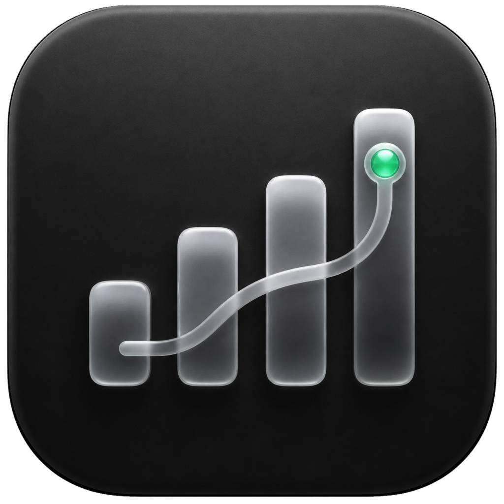

<p align="center">
  
</p>

# DJ 4G Hub for Windows

[DJ 4G Hub](https://github.com/WongLoki/DJ4Hub) 的 Windows 移植版：在 Windows 上透過 **DJI 4G 模組**（USB `2ca3:4006`，Quectel QDC507）原有的 USB 介面，提供裝置狀態、簡訊、SIM 通話控制、eSIM Profile、行動網路、聯網活動與 AT 除錯等功能，不修改模組韌體。

服務與網頁都在本機執行，預設只監聽 `127.0.0.1:7575`，沒有遠端遙測。

> [!IMPORTANT]
> 本專案是非官方的獨立專案，未獲 DJI、Quectel 或電信業者授權、贊助或認可。DJI 及相關產品名稱為其權利人的商標，僅用於說明相容性。

## 與 macOS 版的差異

| 專案 | macOS（上游） | Windows（本專案） |
| --- | --- | --- |
| AT 通道 | libusb 直接佔用 USB bulk 介面 | Quectel 驅動提供的「AT Port」COM 埠 |
| 行動上網 | 切到 `usbnet=1`（ECM）才有網卡 | `usbnet=0` 搭配 Quectel NDIS／MBIM 驅動即為 Windows「行動電話」介面，可同時收發簡訊與上網 |
| 網卡處理 | `networksetup` 啟用服務、重新 DHCP | 以 netsh 連線行動寬頻；網卡被停用時經 UAC 啟用 |
| 聯網活動 | `nettop`，含每條連線流量 | TCP 連線表，列出應用與目標；Windows 不提供單條連線流量 |
| 啟動器 | shell 指令碼 | `dj4ghub.exe` 內建子命令，雙擊即可啟動 |
| 原生 App／實驗音訊 | SwiftUI App、ADB 音訊 | 不提供；通話控制（撥號、接聽、掛斷、按鍵）仍可用 |

## 需求

- Windows 10／11（x64 或 ARM64）
- DJI 4G 模組與可傳輸資料的 USB-C 線
- Quectel Windows USB 驅動程式。安裝後裝置管理員應出現：
  - `Quectel USB AT Port (COMx)`：必要，用於所有模組功能
  - 「行動電話」網路介面（NDIS 或 MBIM 驅動）：在 `usbnet=0` 下上網
  - ECM 驅動：僅在切到 `usbnet=1` 時需要

同一時間只能有一個程式開啟 AT 埠；使用前請關閉 QCOM、QNavigator 等工具。

## 使用

從 Release 或自行建置取得 `DJ-4G-Hub-<版本>-windows-amd64.zip`，解壓後雙擊 `dj4ghub.exe`，瀏覽器會開啟 `http://127.0.0.1:7575`。

```text
dj4ghub start          背景啟動並開啟管理網頁（雙擊 exe 等同此命令）
dj4ghub start --demo   不接硬體的示範模式
dj4ghub stop           停止背景服務
dj4ghub status         檢視執行狀態
dj4ghub logs           即時檢視日誌
dj4ghub open           重新開啟管理網頁
dj4ghub activate       檢查模組網卡，必要時連線 Windows 行動寬頻後結束
dj4ghub serve --port COM17
                       在前景執行並指定 AT 埠（除錯用）
```

## 工作模式

| 模式 | 頁面名稱 | Windows 上的效果 |
| --- | --- | --- |
| `usbnet=0` | 簡訊模式 | AT 埠 + 行動寬頻介面（需 NDIS／MBIM 驅動），建議使用 |
| `usbnet=1` | 上網模式 | CDC ECM 網卡（需 ECM 驅動） |
| `usbnet=2/3` | 實驗模式 | 未驗證 |

切換模式會讓 USB 重新列舉，頁面短暫斷線屬正常現象。不要在 eSIM Profile 寫入過程中拔除模組或切換模式。

## 本機資料

```text
%LOCALAPPDATA%\DJ 4G Hub\Logs\dj4ghub.log          日誌
%LOCALAPPDATA%\DJ 4G Hub\service.json              背景服務狀態
%APPDATA%\DJ4Hub\communication-history.sqlite       簡訊與通話紀錄（依 ICCID 區分）
%APPDATA%\DJ 4G Hub\profile-notes.json             eSIM Profile 備註
```

簡訊輪詢會先把模組 ME 儲存區的簡訊寫入本機紀錄，成功後再清除模組上的副本（沿用上游行為）。發布 Issue、截圖或日誌前，請遮蔽電話號碼、驗證碼、EID、ICCID、IMSI 等個人資訊。

## 從原始碼建置

需要 Go 1.26 以上與 PowerShell。

```powershell
go test ./...
pwsh -File scripts/build-windows.ps1            # 產出 dist\DJ-4G-Hub-<版本>-windows-amd64.zip
pwsh -File scripts/build-windows.ps1 -Arch arm64
```

接上模組時可執行唯讀實機測試：

```powershell
go test -tags hardware -run Hardware -v ./cmd/dj4ghub
```

程式結構與平臺層說明見 [SOURCE_STRUCTURE.md](SOURCE_STRUCTURE.md)。

## 目前限制

- 實驗性模組通話音訊（ADB 載入驅動）不支援 Windows。
- 通訊紀錄雲端備份的設定介面原本在 macOS App 中，Windows 版尚未提供。
- 執行檔未簽章，首次執行時 SmartScreen 可能提示。
- 不同 SIM、eUICC、電信業者、漫遊環境與模組韌體可能有差異。

## 來源與授權

本專案移植自 [WongLoki/DJ4Hub](https://github.com/WongLoki/DJ4Hub)（commit `3914cd6`），其程式碼又演進自 [ZenGeekLabs/DJOneHub](https://github.com/ZenGeekLabs/DJOneHub) 與 [iniwex5/vohive](https://github.com/iniwex5/vohive)。

根目錄程式碼遵循 [PolyForm Noncommercial License 1.0.0](LICENSE)，**不得作商業用途**。必須保留的上游宣告：

```text
Required Notice: Copyright iniwex5 (https://github.com/iniwex5/vohive)
```

第三方元件授權見 [THIRD_PARTY_NOTICES.md](THIRD_PARTY_NOTICES.md) 與各 `third_party/` 目錄。
